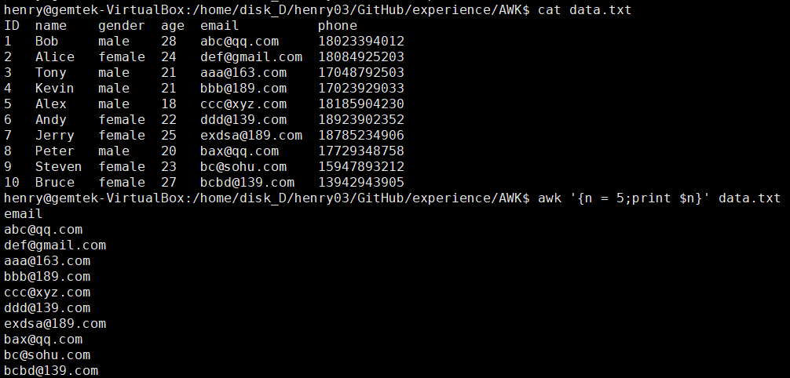
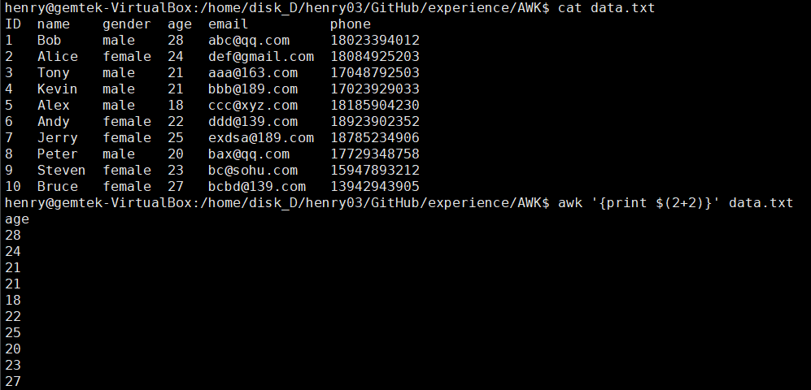
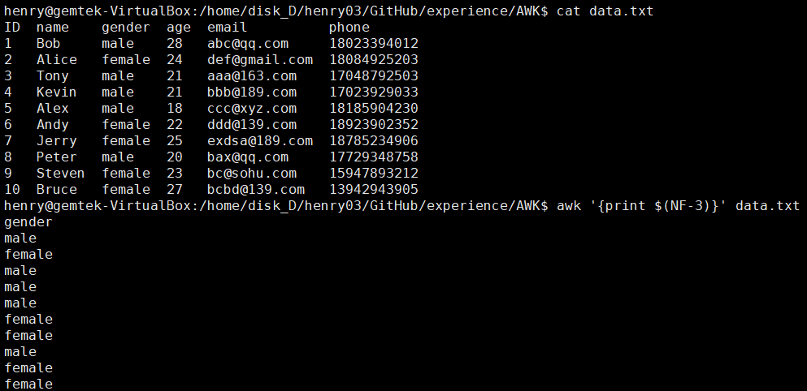

# Linux Awk Command
##### 演示資料(data.txt)

        ID  name    gender  age  email          phone
        1   Bob     male    28   abc@qq.com     18023394012
        2   Alice   female  24   def@gmail.com  18084925203
        3   Tony    male    21   aaa@163.com    17048792503
        4   Kevin   male    21   bbb@189.com    17023929033
        5   Alex    male    18   ccc@xyz.com    18185904230
        6   Andy    female  22   ddd@139.com    18923902352
        7   Jerry   female  25   exdsa@189.com  18785234906
        8   Peter   male    20   bax@qq.com     17729348758
        9   Steven  female  23   bc@sohu.com    15947893212
        10  Bruce   female  27   bcbd@139.com   13942943905

#### 讀取文件的幾種方式

	1.按字符數量讀取: 
		每一次可以讀取一個字符，或者多個字符，直到把文件讀取完
	2.按照分隔符號進行讀取:
		一直讀取直到遇到了分隔符號才停止，下次繼續從分隔符號的位置向後讀取，直到讀完整個文件
	3.按行讀取:
		每次讀取一行，直到讀完整個文件
			是按照分隔符號進行讀取的一種特殊情況，**將分隔符號指定為患行符號(\n)**
	4.一次性讀取整個文件
	5.按照字符數量讀取:
		一次讀取指定數量的字符數，直到把文件讀完

#### 透過"Read"指令來讀取文件
##### 1. 按字符数量读取

```bash
# 正确
while read -N 3 data;do
  echo "$data"
done <data.txt


# 错误
while read -N 3 data < data.txt;do
  echo "$data"
done

```
##### 2. 按分隔符读取
```bash
while read -d "m" data ;do
  echo "$data"
done <a.txt
```
##### 3. 按行读取
```bash
while read line;do
  echo "$line"
done <a.txt
```
##### 3. 一次性读整个文件
- 按照字符数量读取，且指定的字符数要大于文件的总大小
- 按分隔符读取，且指定的分隔符是文件中不存在的字符，这样的话会一直读取，因为找不到分隔符而读完整个文件

```bash
# 指定超出文件大小的字符数量
read -N 1000000 data <a.txt
echo "$data"

# 指定文件中不存在的字符作为分隔符
read -d "_" data <a.txt
echo "$data"
```

------------


# awk入門用法
    awk 'program' data.txt
- 單引號包圍的是awk代碼，或稱為awk程序
- 盡量使用單引號，因為在awk中經常使用$符號，而$符號在Shell是變量符號，<font color=#FF0000>如果使用雙引號包圍awk代碼，則$符號會被Shell解析成Shell變量，然後進行Shell變量替換。使用單引號包圍awk代碼，則$符號會脫離Shell的魔掌，使得$符號留給awk去解析。</font>
- 大括號表示代碼區塊，代碼區塊中間可以之間連用，<font color=#FF0000>代碼區塊內部的多個語句需使用分號";"分隔。</font>
##### 範例(ex1.sh)
	```shell
	# 输出a.txt中的每一行
	awk '{print $0}' data.txt

	# 多个代码块，代码块中多个语句
	# 输出每行之后还输出两行：hello行和world行
	awk '{print $0}{print "hello";print "world"}' data.txt
	```
##### 解析
	1. 
	對於`awk '{print $0}' a.txt`
	它類似於Shell的while循環`while read line;do echo "$line";done <data.txt`
	awk隐藏了读取每一行的while循环，它会自动读取每一行
	2. 流程:
		a. 读取文件第一行
		b. 将所读取的行赋值给awk的變量$0，於是$0中保存的就是本次所读取的行数据
		c. 進入代码块{print $0}并執行其中代码print $0
		d. 執行完本次代码之后，进入下一轮awk循环：继续读取下一行(第二行)，…不断循环，直到读完文件所有数据…
		e. 退出awk

# BEGIN and END代碼區塊
    awk 'BEGIN{print "我在前面"}{print $0}' data.txt
    awk 'END{print "我在后面"}{print $0}' data.txt
    awk 'BEGIN{print "我在前面"}{print $0}END{print "我在后面"}' data.txt
#### 解析
1. BEGIN代碼區塊
	- 在讀取文件之前執行，且只執行一次
	- 在BEGIN代碼區塊中，不能使用$0或其他特殊變量
1. Main代碼區塊
	- 循環讀取文件，每讀取一行，就執行一次Main代碼區塊
	- Main代碼區塊可以有多個
1. END代碼區塊
	- 在讀取文件完成之後執行，且只執行一次
	- END代碼區塊中可以使用$0和其他特殊變量，但是這些特殊變量都是最後一輪awk循環的數據

# Awk命令行結構和語法結構
	awk的語法充斥著pattern{action}的模式，它們稱為awk rule。

------------


	# 特殊pattern
	BEGIN
	END

	# 布爾代碼塊
	/regular expression/    # 正則匹配成功與否 /a.*ef/{action}
	relational expression   # 即等值比較、大小比較 3>2{action}
	pattern && pattern      # 邏輯與 3>2 && 3>1 {action}
	pattern || pattern      # 邏輯或 3>2 || 3<1 {action}
	! pattern               # 邏輯取反 !/a.*ef/{action}
	(pattern)               # 改變優先級
	pattern ? pattern : pattern  # 三目運算符決定的布爾值

	# 範圍pattern，非布爾代碼塊
	pattern1, pattern2      # 範圍，pat1打開、pat2關閉，即flip,flop模式


# 分析awk如何读取文件
#### awk读取输入文件时，每次读取一条记录(record)(默认情况下按行读取，所以此时记录就是行)。
#### 每读取一条记录，将其保存到$0中，然后执行一次main代码段。
	awk '{print $0}' data.txt
#### 如果是空文件，则因为无法读取到任何一条记录，将导致直接关闭文件，而不会进入main代码段。
	touch x.log  # 创建一个空文件
	awk '{print "hello world"}' x.log
#### 可设置表示输入记录分隔符的预定义变量RS(Record Separator)来改变每次读取的记录模式。
	# RS="\n" 、 RS="m"
	awk 'BEGIN{RS="\n"}{print $0}' data.txt
	awk 'BEGIN{RS="m"}{print $0}' data.txt
# 分析awk字段分割
#### awk读取每一条记录之后，会将其赋值给$0，同时还会对这条记录按照预定义变量FS划分字段，将划分好的各个字段分别赋值给$1 $2 $3 $4...$N，同时将划分的字段数量赋值给预定义变量NF
##### 引用字段的方式
	$N引用字段：
		N=0：即$0，引用记录本身
		0<N<=NF：引用对应字段
		N>NF：表示引用不存在的字段，返回空字符串
		N<0：报错
------------
	awk '{n = 5;print $n}' data.txt


	awk '{print $(2+2)}' data.txt   # 括号必不可少，用于改变优先级


	awk '{print $(NF-3)}' data.txt



