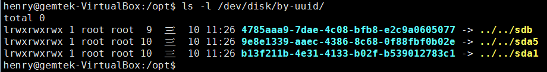
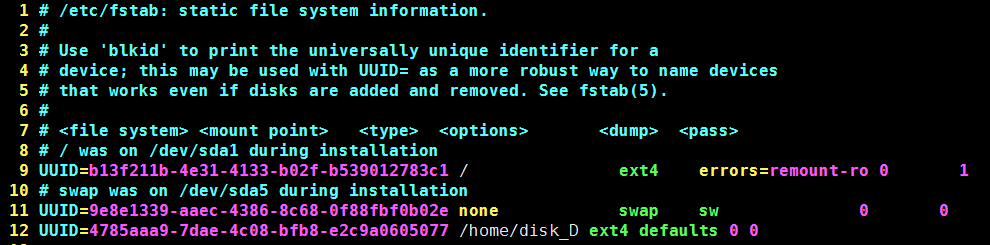

# 重灌Linux Server SOP


1. 新增使用者
	* sudo adduser "User_name"
2. 變更權限
	1. sudo chmod 777 /etc/sudoers
	2. sudo vi /etc/sudoers
	3. "User_name" ALL=(ALL:ALL) ALL
	4. sudo chmod 440 /etc/sudoers
	5. 若出現
		1. sudo: /etc/sudoers is world writable
		2. sudo: /no valid sudoers sources found, quitting.
		3. sudo: unable to initiablize policy plugin
	6. sudo pkexec chmod 440 /etc/sudoers
	7. sudo pkexec chmod 440 /etc/sudoers-d/README
3. 安裝ssh-server 
	1. sudo apt-get install openssh-server
4. 安裝git, repo
	1. sudo apt-get install git
	2. sudo apt-get install repo
	3. sudo apt-get install phablet-tools
5. 安裝toolchain
	1. 將放置到/opt底下
		1. tar jxvf toolchain.tar.bz2
		2. cp toolchain /opt/toolchains
6. 安裝一些套件
	1. sudo apt-get install automake lib1zo2-dev uuid-dev zlib1g-dev
7. 將sh指向到bash
	1. sudo dpkg-reconfigure dash
	2. select "NO"
	3. check whether success
	4. cd /bin
	5. ls -la *sh
8. VM掛載新硬碟
	1. 查看硬碟UUID
		1.ls -l /dev/disk/by-uuid/
		2. 
	2. auto mount Disk
		1. sudo vi /etc/fstab
		2. UUID=_____________ 掛載位置(eg. /home/gemteks) ext4 defaults 0 0
		3. 
	3. 修改權限
		1.  sudo chmod 777 /home/disk_D/henry03
		2.  sudo chown -R henry:henry /home/disk_D/henry03
9. 安裝Samba
	1.  sudo apt-get install samba
	2.  add samba user
	3.  sudo smbpasswd -a "User_name" (eg. henry)
	4.  enter passwd
	5.  vi /etc/samba/smbd.conf
	6.  restart samba
	7.  sudo service smbd restart
	8.  reboot
	```c  
    [User_name] (eg. [henry])
	    path = /hone/disk_D/henry03
        writeable = yes
        valid user = henry
